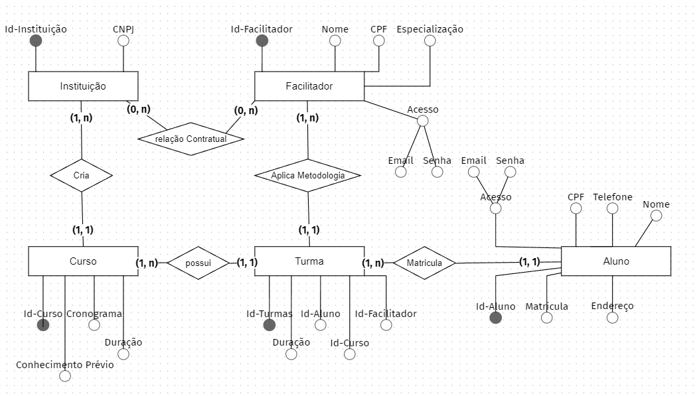

# Projeto-Individual-M-dulo-4

Para apoiar nesse sistema recebemos a tarefa de realizar essa modelagem e responder algumas perguntas com nosso modelo:
⇨ Existem outras entidades além dessas três?
Sim, para este projeto foram criados, alem de cursos, turma e aluno; foram criados tambem: instituição e facilitador.
⇨ Quais são os principais campos e tipos?

Os principais campos são as chaves primarias (PK) que são elas : id-cursos, id-turma, id-aluno, id-instituição e id-facilitador ; todos possuem seu valor int, tambem serão usadas as mesmas como chave extrangeira (FK).
⇨ Como essas entidades estão relacionadas?

As entidades se relacionam da seguinte forma : A instituição (1,n) Cria o curso (1,1); O curso (1,n) possui turmas (1,1); O aluno(1,1) se matricula na turma (1,n); O facilitador (1,n) aplica metodologia a turma (1,1).
